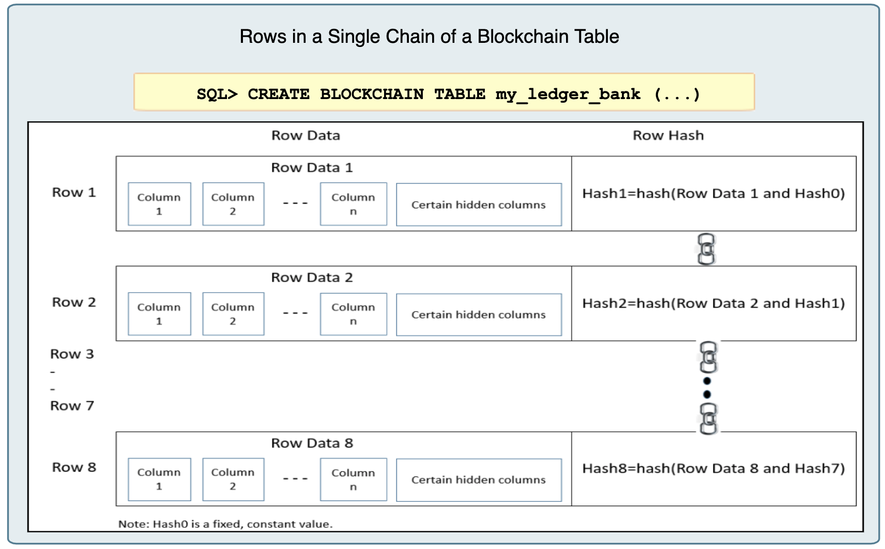

# Oracle Blockchain Table

## Introduction

This lab walks you through the steps to the Oracle blockchain table which including create blockchain table, insert rows, verify the rows, alter blockchain table and add row signature.

Estimated Lab Time: 30 minutes

### About Blockchain Table
Blockchain tables are insert-only tables that organize rows into a number of chains. Each row in a chain, except the first row, is chained to the previous row in the chain by using a cryptographic hash.



Rows in a blockchain table are tamper-resistant. Each row contains a cryptographic hash value which is based on the data in that row and the hash value of the previous row in the chain. If a row is tampered with, the hash value of the row changes and this causes the hash value of the next row in the chain to change. For enhanced fraud protection, an optional user signature can be added to a row. If you sign a blockchain table row, a digital certificate must be used. While verifying the chains in a blockchain table, the database needs the certificate to verify the row signature.

### Objectives

  In this lab, you will learn:

* Blockchain table fundamental
* Alter blockchain table
* add row signature

### Prerequisites

This is the prerequisites for the lab: 

* Oracle database 20c or up.

  

## **STEP 1**: Blockchain Table Fundamental

You can create a blockchain table using the `CREATE BLOCKCHAIN TABLE` statement. The `NO DROP`, `NO DELETE`, `HASHING USING`, and `VERSION` clauses are mandatory in a `CREATE BLOCKCHAIN TABLE` statement.

1. Connect PDB with sysdba user, create a test user.

  ```
  [oracle@db20c ~]$ sqlplus / as sysdba
  
  SQL*Plus: Release 20.0.0.0.0 - Production on Mon Sep 21 09:42:12 2020
  Version 20.3.0.0.0
  
  Copyright (c) 1982, 2020, Oracle.  All rights reserved.
  
  
  Connected to:
  Oracle Database 20c EE Extreme Perf Release 20.0.0.0.0 - Production
  Version 20.3.0.0.0
  
  SQL> alter session set container=pdb1;
  
  Session altered.
  
  SQL> create user testuser identified by WelcomePTS_123#;
  
  User created.
  
  SQL> grant connect,resource to testuser;
  
  Grant succeeded.
  
  SQL> grant create any directory to testuser;
  
  Grant succeeded.
  
  SQL> alter user testuser quota unlimited on users;
  
  User altered.
  
  SQL> exit
  Disconnected from Oracle Database 20c EE Extreme Perf Release 20.0.0.0.0 - Production
  Version 20.3.0.0.0
  [oracle@db20c ~]$ 
  ```

  

2. Connect to the test user.

  ```
  [oracle@db20c ~]$ sqlplus testuser/WelcomePTS_123#@localhost:1521/pdb1.sub11160748350.myvcnseoul.oraclevcn.com
  
  SQL*Plus: Release 20.0.0.0.0 - Production on Mon Sep 21 09:47:15 2020
  Version 20.3.0.0.0
  
  Copyright (c) 1982, 2020, Oracle.  All rights reserved.
  
  
  Connected to:
  Oracle Database 20c EE Extreme Perf Release 20.0.0.0.0 - Production
  Version 20.3.0.0.0
  
  SQL> 
  ```

  

3. Create a sample blockchain table.

  ```
  <copy>
  create blockchain table orders
  (order_id number(12) primary key,
  customer_id number(12),
  order_date date,
  order_value number(8,2))
  no drop until 31 days idle
  no delete until 16 days after insert
  hashing using "SHA2_512" version "v1";
  </copy>
  ```

  With the option "NO DROP LOCKED" or "NO DROP UNTIL number DAYS IDLE" we indicate that the table cannot be removed until after 31 days of no new insert.
  With the option "NO DELETE LOCKED" or "NO DELETE UNTIL ... " we indicate that the retention above cannot be altered or it cannot be deleted until after a period.
  In the example above, the table can be deleted after 31 days of inactivity at the latest (default is 16). Individual lines cannot be deleted after 16 days when insert.

4. Show the blockchain table.

    ```
    SQL> select * FROM user_blockchain_tables; 
    
    TABLE_NAME
    --------------------------------------------------------------------------------
    ROW_RETENTION ROW TABLE_INACTIVITY_RETENTION HASH_ALG
    ------------- --- -------------------------- --------
    ORDERS
    	   16 NO			  31 SHA2_512
    ```

    

5. Show the all the columns, including hidden columns of the blockchain table.

    ```
    <copy>
    set linesize 100
    col column_name format a30
    col data_type format a30
    select internal_column_id "Col_ID", column_id, column_name, data_type, data_length from user_tab_cols where table_name='ORDERS';
    </copy>
    ```

    The result likes the following:

    ```
    SQL> set linesize 100
    SQL> col column_name format a30
    SQL> col data_type format a30
    SQL> select internal_column_id "Col_ID", column_name, data_type, data_length from     user_tab_cols where table_name='ORDERS';
    
        Col_ID COLUMN_NAME			  DATA_TYPE			 DATA_LENGTH
    ---------- ------------------------------ ------------------------------ -----------
    	 1 ORDER_ID			  NUMBER				  22
    	 2 CUSTOMER_ID			  NUMBER				  22
    	 3 ORDER_DATE			  DATE					   7
    	 4 ORDER_VALUE			  NUMBER				  22
    	 5 ORABCTAB_INST_ID$		  NUMBER				  22
    	 6 ORABCTAB_CHAIN_ID$		  NUMBER				  22
    	 7 ORABCTAB_SEQ_NUM$		  NUMBER				  22
    	 8 ORABCTAB_CREATION_TIME$	  TIMESTAMP(6) WITH TIME ZONE		  13
    	 9 ORABCTAB_USER_NUMBER$	  NUMBER				  22
    	10 ORABCTAB_HASH$		  RAW					2000
    	11 ORABCTAB_SIGNATURE$		  RAW					2000
    	12 ORABCTAB_SIGNATURE_ALG$	  NUMBER				  22
    	13 ORABCTAB_SIGNATURE_CERT$	  RAW					  16
    	14 ORABCTAB_SPARE$		  RAW					2000
    
    14 rows selected.
    
    SQL> 
    ```

    The description of the hidden columns, (Column names are simplified for brevity).

    

    

6. Insert blockchain data.

    ```
    <copy>
    insert into orders values(1, 101, to_date('2020-09-01','YYYY-MM-DD'), 100);
    insert into orders values(2, 102, to_date('2020-09-01','YYYY-MM-DD'), 2000);
    insert into orders values(3, 103, to_date('2020-09-02','YYYY-MM-DD'), 300);
    commit;
    </copy>
    ```

    

7. Select the rows in the blockchain table.

    ```
    SQL> select * from orders;
    
      ORDER_ID CUSTOMER_ID ORDER_DAT ORDER_VALUE
    ---------- ----------- --------- -----------
    	 1	   101 01-SEP-20	 100
    	 2	   102 01-SEP-20	2000
    	 3	   103 02-SEP-20	 300
    
    ```

    

8. Select hidden columns in the blockchain table.

    ```
    <copy>select order_id, ORABCTAB_INST_ID$, ORABCTAB_CHAIN_ID$, ORABCTAB_SEQ_NUM$,ORABCTAB_HASH$ from orders;</copy>
    ```

    The result likes the following:

    ```
    SQL> select order_id, ORABCTAB_INST_ID$, ORABCTAB_CHAIN_ID$, ORABCTAB_SEQ_NUM$,ORABCTAB_HASH$ from orders;
    
      ORDER_ID ORABCTAB_INST_ID$ ORABCTAB_CHAIN_ID$ ORABCTAB_SEQ_NUM$
    ---------- ----------------- ------------------ -----------------
    ORABCTAB_HASH$
    --------------------------------------------------------------------------------
    	 1		   1		     15 		1
    097813E56BF06EE32881A2FD7F8D50E9348B02DA3F36515EDB8CBF966979D57099AEC7BD0DE3CEA6
    64381680D4A83F5857A6378D9E34EFA7C1B89EA7F67BF51D
    
    	 2		   1		     15 		2
    8EB1642CB4425F57A8638E013AE726B1290A67A13B70D0AE6B4D14018C1703644637868246CDE976
    0CE6D5F40E4953449CAD5F077B026FE1199C61263A15C6CA
    
    	 3		   1		     15 		3
    
      ORDER_ID ORABCTAB_INST_ID$ ORABCTAB_CHAIN_ID$ ORABCTAB_SEQ_NUM$
    ---------- ----------------- ------------------ -----------------
    ORABCTAB_HASH$
    --------------------------------------------------------------------------------
    D89A434E6431289E06A109A2F43CEBBF9B0F4B37E7E492D1053987EFAB2EE93207A0880E19668B94
    D21E1B4C662922B571F8F63BACD969DD31FFC38E5953A941
    
    ```

    

9. Delete, Update the rows or Drop the blockchain table are not allowed.

    ```
    SQL> delete orders where order_id=2;
    delete orders where order_id=2
           *
    ERROR at line 1:
    ORA-05715: operation not allowed on the blockchain table
    
    
    SQL> update orders set order_value=400 where order_id=1;
    update orders set order_value=400 where order_id=1
           *
    ERROR at line 1:
    ORA-05715: operation not allowed on the blockchain table
    
    
    SQL> drop table orders;
    drop table orders
               *
    ERROR at line 1:
    ORA-05723: drop blockchain table ORDERS not allowed
    ```

10. You cannot delete rows in a blockchain table with the DML `DELETE` command. You must use the `DBMS_BLOCKCHAIN_TABLE` package.

    ```
    SQL> set serveroutput on
    SQL> DECLARE
       NUMBER_ROWS NUMBER;
    BEGIN
       DBMS_BLOCKCHAIN_TABLE.DELETE_EXPIRED_ROWS('TESTUSER','ORDERS', null, NUMBER_ROWS);
       DBMS_OUTPUT.PUT_LINE('Number of rows deleted=' || NUMBER_ROWS);
    END;
    /  
    Number of rows deleted=0
    
    PL/SQL procedure successfully completed.
    
    SQL> 
    ```

   You can delete rows in a blockchain table only by using the `DBMS_BLOCKCHAIN_TABLE` package, and only rows that are outside the retention period. This is the reason why the procedure successfully completes without deleting any row.

   

## **STEP 2:** Alter Blockchain Table

You can modify the retention period for the blockchain table and for rows within the blockchain table. The retention period cannot be reduced while altering a blockchain table definition. If you use the `LOCKED` clause, this indicates that this setting can never be modified.

1. Modify the table retention period.

    ```
    SQL> alter table orders NO DROP UNTIL 20 DAYS IDLE;
    alter table orders NO DROP UNTIL 20 DAYS IDLE
    *
    ERROR at line 1:
    ORA-05732: retention value cannot be lowered
    
    
    SQL> alter table orders NO DROP UNTIL 60 DAYS IDLE;
    
    Table altered.
    ```

  

2. Modify the rows retention period.

    ```
    SQL> alter table orders NO DELETE UNTIL 15 DAYS AFTER INSERT LOCKED;
    alter table orders NO DELETE UNTIL 15 DAYS AFTER INSERT LOCKED
    *
    ERROR at line 1:
    ORA-05732: retention value cannot be lowered
    
    
    SQL> alter table orders NO DELETE UNTIL 30 DAYS AFTER INSERT LOCKED;
    
    Table altered.
    
    SQL> 
    ```

    Now, the rows retention period can never be modified because the `LOCKED` clause set.

    

## Step 3: (Optional) Adding a Row Signature

Signing a row sets a user signature for a previously created row. A signature is optional and provides additional security against tampering. Oracle Database verifies that the current user owns the row being updated and the hash, if provided, matches the stored hash value of the row. You must use a digital certificate when adding a signature to a blockchain table row. The signature is validated using the specified digital certificate and signature algorithm.

1. Generate a digital certificate with OPENSSL.

   ```
   <copy>openssl req -newkey rsa:2048 -nodes -keyout domain.key -x509 -days 365 -out domain.crt</copy>
   ```

   This command creates a 2048-bit private key (`domain.key`) and a self-signed certificate (`domain.crt`) . It's will be expired in 365 days.

   ```
   [oracle@db20c ~]$ openssl req -newkey rsa:2048 -nodes -keyout domain.key -x509 -days 365 -out domain.crt
   Generating a 2048 bit RSA private key
   ..............+++
   .........+++
   writing new private key to 'domain.key'
   -----
   You are about to be asked to enter information that will be incorporated
   into your certificate request.
   What you are about to enter is what is called a Distinguished Name or a DN.
   There are quite a few fields but you can leave some blank
   For some fields there will be a default value,
   If you enter '.', the field will be left blank.
   -----
   Country Name (2 letter code) [XX]:US
   State or Province Name (full name) []:Phoenix
   Locality Name (eg, city) [Default City]:
   Organization Name (eg, company) [Default Company Ltd]:Oracle
   Organizational Unit Name (eg, section) []:PTS
   Common Name (eg, your name or your server's hostname) []:db
   Email Address []:db@email.com
   [oracle@db20c ~]$ ls -l
   total 24
   -rw-r--r-- 1 oracle oinstall 1383 Sep 21 07:29 domain.crt
   -rw-r--r-- 1 oracle oinstall 1708 Sep 21 07:29 domain.key
   [oracle@db20c ~]$ 
   ```

   

2. Adding the Digital Certificate to the Database, assume the digital certificate file is stored in `/home/oracle`, named `domain.crt`.

   ```
   SQL> create or replace directory my_dir as '/home/oracle';
   
   Directory created.
   
   SQL> set serveroutput on
   SQL> DECLARE
   	file       BFILE;
   	buffer     BLOB;
   	amount     NUMBER := 32767;
   	cert_guid  RAW(16);
   BEGIN
   	file := BFILENAME('MY_DIR', 'domain.crt');
   	DBMS_LOB.FILEOPEN(file);
   	DBMS_LOB.READ(file, amount, 1, buffer);
   	DBMS_LOB.FILECLOSE(file);
   	DBMS_USER_CERTS.ADD_CERTIFICATE(buffer, cert_guid);
   	DBMS_OUTPUT.PUT_LINE('Certificate GUID = ' || cert_guid);
   END;
   /   
   Certificate GUID = AFCEE7D4012FA87DE0533E00000AB8F7
   
   PL/SQL procedure successfully completed.
   
   SQL> 
   ```

   

3. Viewing Information About Certificates.

   ```
   SQL> SELECT user_name, distinguished_name, certificate_guid FROM user_certificates;
   
   USER_NAME
   --------------------------------------------------------------------------------
   DISTINGUISHED_NAME
   --------------------------------------------------------------------------------
   CERTIFICATE_GUID
   --------------------------------
   TESTUSER
   EMAIL=db@email.com,CN=db,OU=PTS,O=Oracle,L=Default City,ST=Phoenix,C=US
   AFCEE7D4012EA87DE0533E00000AB8F7
   ```

   

4. We will signature the first record in the blockchain table. First, the hash value of the line is calculated and the bytes are written to the signature1.dat file.

   ```
   <copy>DECLARE 
           row_data BLOB; 
           buffer RAW (4000); 
           inst_id BINARY_INTEGER; 
           chain_id BINARY_INTEGER; 
           sequence_no BINARY_INTEGER; 
           row_len BINARY_INTEGER; 
           l_file UTL_FILE.FILE_TYPE; 
   
   BEGIN 
           SELECT ORABCTAB_INST_ID$, ORABCTAB_CHAIN_ID$, ORABCTAB_SEQ_NUM$ INTO inst_id, chain_id, sequence_no FROM orders where order_id=1; 
           DBMS_BLOCKCHAIN_TABLE.GET_BYTES_FOR_ROW_SIGNATURE ('TESTUSER', 'ORDERS', inst_id, chain_id, sequence_no, 1, row_data); 
           row_len:= DBMS_LOB.GETLENGTH (row_data); 
           DBMS_LOB.READ (row_data, row_len, 1, buffer);
          l_file:= UTL_FILE.fopen ('MY_DIR', 'signature1.dat', 'wb', 32767); 
          UTL_FILE.put_raw (l_file, buffer, TRUE); 
          UTL_FILE.fclose (l_file); 
   END; 
   /</copy>
   ```

   

5. The signature is then calculated outside the database with OPENSSL using the certificate and saved in binary format in the sign1.final file.

   ```
   [oracle@db20c ~]$ openssl dgst -sha512 -sign domain.key -out sign1.final signature1.dat
   [oracle@db20c ~]$ ls -l
   total 24
   -rw-r--r-- 1 oracle oinstall 1383 Sep 21 07:29 domain.crt
   -rw-r--r-- 1 oracle oinstall 1708 Sep 21 07:29 domain.key
   -rw-r--r-- 1 oracle oinstall  256 Sep 21 07:57 sign1.final
   -rw-r--r-- 1 oracle oinstall   64 Sep 21 07:54 signature1.dat
   [oracle@db20c ~]$ 
   ```

   

6. Then we can add the signature to the first row in the blockchain table.

   ```
   <copy>DECLARE 
           inst_id binary_integer; 
           chain_id binary_integer; 
           sequence_no binary_integer; 
           signature RAW (2000); 
           cert_guid RAW (16):= HEXTORAW ('AFCEE7D4012EA87DE0533E00000AB8F7'); 
           file bfile; 
           amount number:= 2000; 
           buffer RAW (4000); 
   BEGIN 
           SELECT ORABCTAB_INST_ID$, ORABCTAB_CHAIN_ID$, ORABCTAB_SEQ_NUM$ INTO inst_id, chain_id, sequence_no FROM orders WHERE order_id=1; 
           file:= bfilename ('MY_DIR', 'sign1.final'); 
           DBMS_LOB.FILEOPEN (file); 
           dbms_lob.READ (file, amount, 1, signature); 
           dbms_lob.FILECLOSE (file);
           DBMS_BLOCKCHAIN_TABLE.SIGN_ROW ('TESTUSER', 'ORDERS', inst_id, chain_id, sequence_no, NULL, signature, cert_guid, DBMS_BLOCKCHAIN_TABLE.SIGN_ALGO_RSA_SHA2_512); 
   END; 
   /</copy>
   ```

   

7. If you select the table row again, you will find the corresponding signature information in the columns `ORABCTAB_SIGNATURE$`, `ORABCTAB_SIGNATURE_ALG$` and `ORABCTAB_SIGNATURE_CERT$`.

   ```
   SQL> select order_id, ORABCTAB_INST_ID$, ORABCTAB_CHAIN_ID$, ORABCTAB_SEQ_NUM$, ORABCTAB_SIGNATURE$, ORABCTAB_SIGNATURE_ALG$, ORABCTAB_SIGNATURE_CERT$ from orders where order_id=1;
   
     ORDER_ID ORABCTAB_INST_ID$ ORABCTAB_CHAIN_ID$ ORABCTAB_SEQ_NUM$
   ---------- ----------------- ------------------ -----------------
   ORABCTAB_SIGNATURE$
   --------------------------------------------------------------------------------
   ORABCTAB_SIGNATURE_ALG$ ORABCTAB_SIGNATURE_CERT$
   ----------------------- --------------------------------
   	 1		   1		     15 		1
   616C11CA6802221A08CEF6C7F16D51929F2F3AED28CDC91312491648F8C469C5738ECBC3B6B83AC6
   A10A86904408C357803F3E16B6BC1B1168FFB33789E999643BB084F316028D3C6F2D4BE020D9DADE
   5D269A710F2E57C06F857A4170E4B150C7BB8A3A23594799AB1AAA6B4311955E61C3046A9F196336
   8EC868C937E87C5
   		      3 AFCEE7D4012EA87DE0533E00000AB8F7
   ```

   

8. The following PL/SQL block verifies that the rows in the blockchain table `orders` have not been tampered with since they were created. 

   ```
   SQL> set serveroutput on 
   SQL> DECLARE
           verify_rows NUMBER;
           instance_id NUMBER;
   BEGIN
           instance_id:=1;
           DBMS_BLOCKCHAIN_TABLE.VERIFY_ROWS('TESTUSER','ORDERS', NULL, NULL, instance_id, NULL, verify_rows);
           DBMS_OUTPUT.PUT_LINE('Number of rows verified: ' || verify_rows);
   END;
   /   
   Number of rows verified: 3
   
   PL/SQL procedure successfully completed.
   
   SQL> 
   ```

   Because the `verify_signature` parameter of the `DBMS_BLOCKCHAIN_TABLE.VERIFY_ROWS` procedure is omitted, the default value of TRUE is used. The row contents and the row signature (if present) are verified. If the `verify_signature` parameter is set to FALSE, the row contents are verified, but the row signature is not. You may chose to skip signature verification to conserve the additional time and resources spent on this process.


## Learn More

* [Managing Blockchain Tables](https://docs.oracle.com/en/database/oracle/oracle-database/20/admin/managing-tables.html#GUID-43470B0C-DE4A-4640-9278-B066901C3926)
* [Blockchain Table Practice](https://docs.oracle.com/en/database/oracle/oracle-database/20/ftnew/managing-oracle-blockchain-tables-and-data.html)

## Acknowledgements
* **Author** - Minqiao Wang, Oracle Database Product Management
* **Contributors** -  <Name, Group> -- optional
* **Last Updated By/Date** - <Name, Group, Month Year>
* **Workshop (or Lab) Expiry Date** - <Month Year> 

## See an issue?
Please submit feedback using this [form](https://apexapps.oracle.com/pls/apex/f?p=133:1:::::P1_FEEDBACK:1). Please include the *workshop name*, *lab* and *step* in your request.  If you don't see the workshop name listed, please enter it manually. If you would like for us to follow up with you, enter your email in the *Feedback Comments* section.
